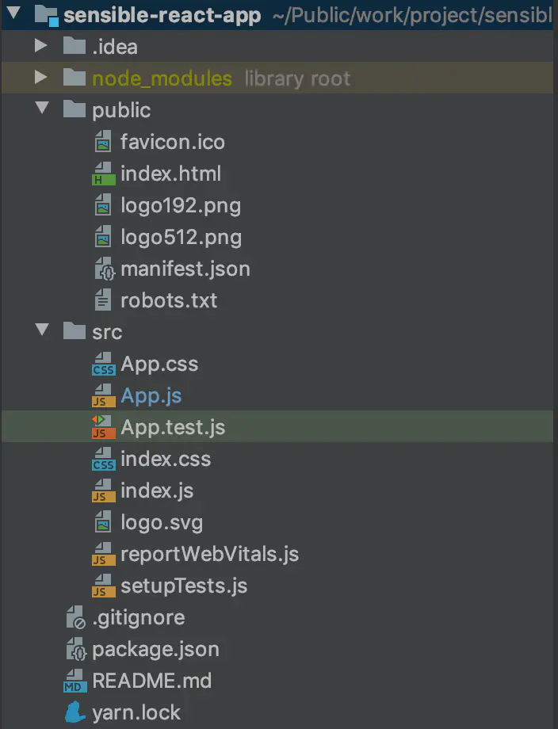
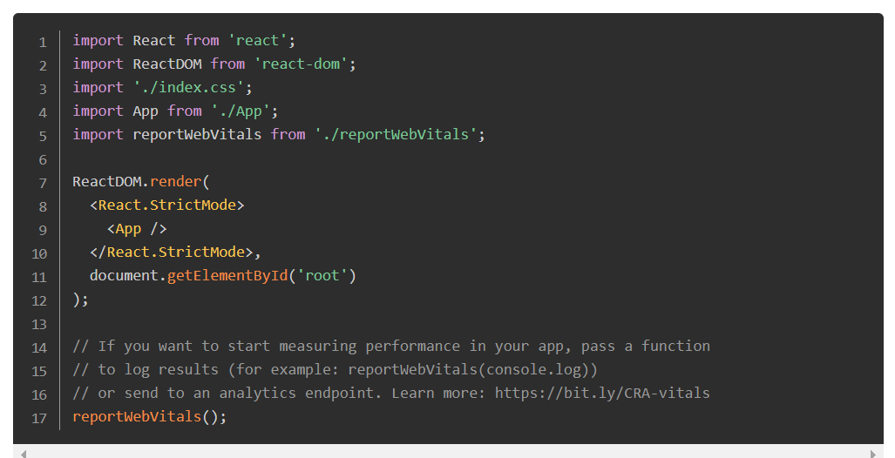
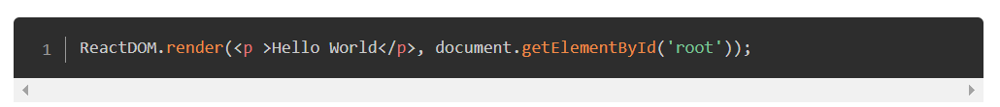

通过create-react-app来构建React项目
create-react-app 是来自 FaceBook 的脚手架工具,
用于快速构建工程化的 React 项目,
它是基于 Node.js 环境的,可以通过npm来进行安装.

windows:
npm install -g create-react-app  //全局安装
mac
sudo npm install -g create-react-app

构建 React 项目
create-react-app [项目名]

React 工程化项目的结构
构建好之后的React项目,结构大致是这样的

package.json
这个文件管理项目的依赖,相当于maven里的pom.xml文件,
但是它里面还有一些命名,总之,跟Vue是一样的,

public 文件夹
favicon.ico--浏览器tab上的图标,是项目的标志,可以替换为公司的Logo,
index.html--项目的入口文件,
一切从这里开始,这里是代码执行的源头,
其中的

是项目的总容器,
所有的内容都存储在这个容器中,一个项目里有且只能有一个,
我们把这个div称为“根DOM节点”,在此div下的所有内容都由 React DOM 来管理,

src文件夹
存放的是项目的核心内容,也是我们主要的工作区域,
index.js--是和index.html文件关联的唯一接口,
内容如下: 

ReactDOM.render()方法的作用就是将<App/>的内容渲染到根DOM节点中去,
document.getElementById('root')中的"root"便是index.html中的"root"了,
<App />便是引用页面内容了,在这里,
<App />也可以写一些内容(结构,样式,逻辑)是整个项目的根组件,比如:

App.js
该类是继承react提供的component,
export default App;是为了将App公开,index.js才能够引用,
App.js继承了component的话,必须使用render进行渲染,
return的内容是类似于html结构的内容,
就是jsx,jsx语法是react的主要语法,
内部的div的className是为了区分html语法的一个类名,
这个是div的样式引用,在这个文件中,只能用一个div容器,
如果在div的同级目录添加别的内容,便会报错,
className="App",是引用到App.css的样式,
注意,页面内容样式是就近原则,
首先用App.css的样式,App.css是组件的样式,\index.css是全局的样式,
