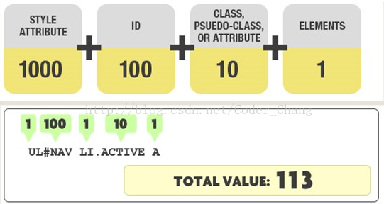

一. css优先级 的 6大分类
通常可以将css的优先级由高到低分为6组:

第一优先级:无条件优先的属性只需要在属性后面使用! important.它会覆盖页面内任何位置定义的元素样式.ie6不支持该属性.

第二优先级:在html中给元素标签加style,即内联样式.该方法会造成css难以管理,所以不推荐使用.

第三优先级:由一个或多个id选择器来定义.例如,#id{margin:0;}会覆盖.classname{margin:3pxl}

第四优先级:由一个或多个类选择器. 属性选择器. 伪类选择器定义.如.classname{margin:3px}会覆盖div{margin:6px;}

第五优先级:由一个或多个类型选择器定义.如div{marigin:6px;}覆盖*{margin:10px；}

第六优先级:通配选择器,如*{marigin:6px;}

二. css优先级 的 优先顺序
行内样式(style="…")>ID 选择器(#box{…})>类选择器(.con{…})>标签选择器(dic{…})>通用选择器(*{…})

三. 选择器 的 权重及优先规则
在css中,会根据选择器的特殊性来决定所定义的样式规则的次序,
具有更特殊选择器的规则优先于一般选择器的规则.
如果两个规则的特殊性相同,那么后定义的规则优先.

那么如何计算选择器的特殊性呢？那就要用到选择器的权重计算了.
计算规则如下图:

四. 权重 的 4个等级定义
我们把特殊性分为4个等级,每一个等级代表一类选择器,没个等级的值相加得出选择器的权重.

4个等级的定义如下:

第一等级:代表内联样式,如style="",权值为 1000

第二等级:代表id选择器,如#content,权值为100

第三等级:代表类,伪类和属性选择器,如.content,权值为10

第四等级:代表标签选择器和伪元素选择器,如div p,权值为1

注意:通用选择器(*),子选择器(>),和相邻同胞选择器(+)并不在这个等级中,所以他们的权值为0

五. 权重 的 优先顺序
行内样式(1000)>ID选择器(100)>类选择器(10)>标签选择器(1)>通用选择器(0)

六. 利用权重值比较优先级
1.权重值越大,优先级越高
2.选择器选择的范围越小越精确,优先级越高

#box p .tt =100+1+10
#box .tt =100+10