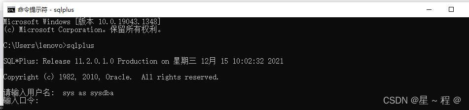
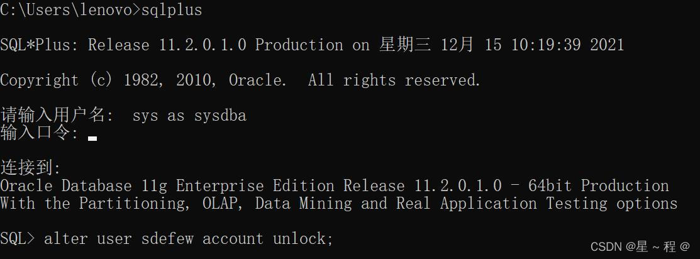
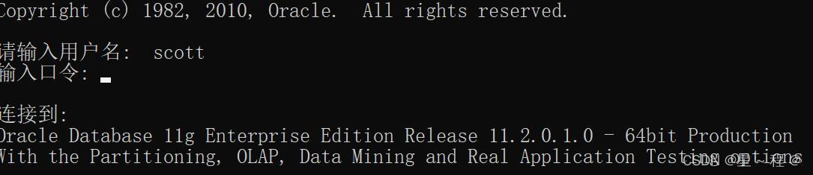

ORA-28000: the account is locked

Win+R打开命令行输入: sqlplus
使用system或sys账户以管理员身份登录，口令即安装Oracle时输入的管理口令

使用命令解锁用户. 命令为: alter user username account unlock

命令为: alter user username account unlock;其中username为用户名
提交: commit;
