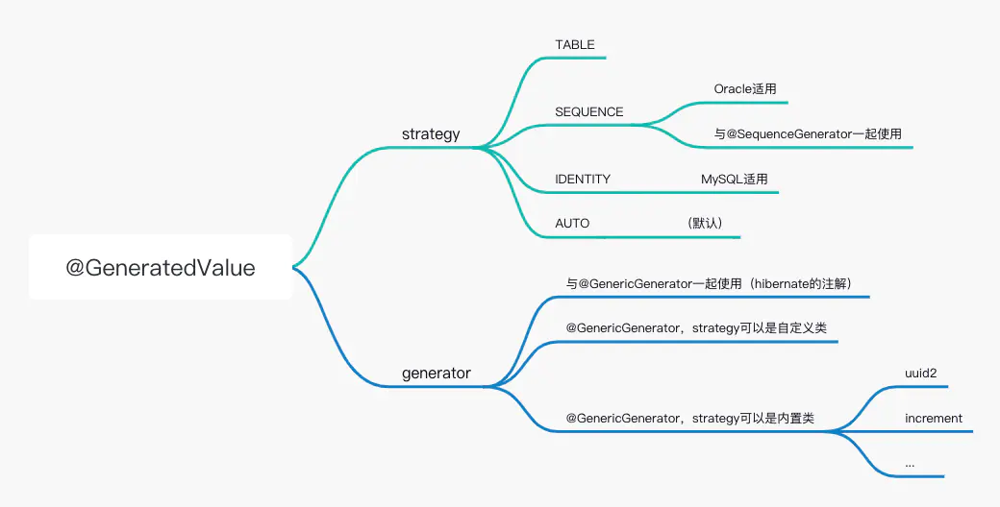

@GeneratedValue

@GeneratedValue注解的主要作用是:
声明主键的生成策略. 很自然的, 它需要和@Id结合使用

TABLE:          使用一个特定的数据库表格存放主键。
SEQUENCE:       根据底层数据库的序列来生成主键，条件是数据库支持序列.(Oracle)
IDENTITY:       主键有数据库自动生成(主要是自动增长类型). (MySQL)
AUTO:           主键由程序控制. (默认), 并同时生成hibernate_sequence用作table id自增
                多表同共时, 会出现跳id情况
@GeneratedValue(strategy = GenerationType.AUTO)
在springboot3和hibernate6时, 会自动生成tableName_SEQ作为自增主键

